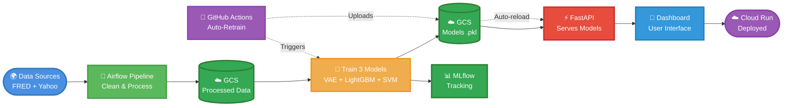

# Financial Stress Test Generator - MLOps Project

**Course**: MLOps (Fall 2024)  
**Group**: MLOps Group 11  
**Project**: End-to-End ML Pipeline for Financial Stress Testing

---

## 📋 Table of Contents

1. [Introduction](#1-introduction)
2. [Project Overview](#2-project-overview)
3. [Tech Stack](#3-tech-stack)
4. [Data Sources](#4-data-sources)
5. [Data Pipeline](#5-data-pipeline)
6. [Model Architecture](#6-model-architecture)
7. [Model Training](#7-model-training)
8. [MLflow Tracking](#8-mlflow-tracking)
9. [Monitoring](#9-monitoring)
10. [Deployment](#10-deployment)
11. [CI/CD Pipeline](#11-cicd-pipeline)
12. [API Documentation](#12-api-documentation)
13. [User Dashboard](#13-user-dashboard)
14. [Project Structure](#14-project-structure)
15. [Setup Instructions](#15-setup-instructions)
16. [Team Members](#16-team-members)

---

## 1. Introduction

The **Financial Stress Test Generator** is a comprehensive MLOps system that uses machine learning to assess financial resilience under adverse economic scenarios. This project implements an end-to-end ML pipeline with automated retraining, monitoring, and deployment capabilities.

### Key Features
- ✅ Automated data ingestion from FRED API and Yahoo Finance
- ✅ Three ML models working in ensemble (VAE, LightGBM, One-Class SVM)
- ✅ Real-time stress testing through interactive dashboard
- ✅ CI/CD pipeline with GitHub Actions
- ✅ Cloud deployment on Google Cloud Platform
- ✅ MLflow experiment tracking
- ✅ Drift detection and monitoring

---

## 2. Project Overview

### Problem Statement
Financial institutions need to assess their resilience against economic shocks such as recessions, market crashes, and geopolitical events. Traditional stress testing methods are manual, time-consuming, and often based on limited scenarios.

### Solution
Our system automates the entire stress testing workflow:
1. **Generate synthetic economic scenarios** using a Variational Autoencoder (VAE)
2. **Predict company performance** under stress using gradient boosting models
3. **Detect anomalies and assess risk** using One-Class SVM with weak supervision
4. **Provide real-time results** through an interactive web dashboard

### Architecture Diagram



---

## 3. Tech Stack

### Languages
- **Python 3.9+**: Core programming language
- **JavaScript/HTML/CSS**: Frontend dashboard

### ML/Data Science Libraries
- **PyTorch**: Deep learning framework for VAE
- **LightGBM / XGBoost**: Gradient boosting models
- **Scikit-learn**: One-Class SVM, preprocessing
- **Pandas / NumPy**: Data manipulation
- **Snorkel**: Weak supervision for labeling

### MLOps Tools
- **Apache Airflow**: Workflow orchestration
- **MLflow**: Experiment tracking and model registry
- **DVC**: Data version control (optional)

### Cloud & Infrastructure
- **Google Cloud Platform (GCP)**:
  - Cloud Storage (GCS): Data and model storage
  - Cloud Run: Serverless deployment
  - Cloud Logging: System monitoring
- **Docker**: Containerization
- **GitHub Actions**: CI/CD automation

### API & Frontend
- **FastAPI**: High-performance API backend
- **React / HTML5**: Interactive dashboard
- **Uvicorn**: ASGI server

---

## 4. Data Sources

### 4.1 FRED API (Federal Reserve Economic Data)
**Source**: [https://fred.stlouisfed.org/](https://fred.stlouisfed.org/)

**Economic Indicators Collected**:
- GDP (Gross Domestic Product)
- CPI (Consumer Price Index)
- Unemployment Rate
- Federal Funds Rate
- VIX (Volatility Index)
- 10-Year Treasury Yield

**Update Frequency**: Daily/Weekly/Monthly (varies by indicator)

### 4.2 Yahoo Finance API
**Source**: [https://finance.yahoo.com/](https://finance.yahoo.com/)

**Financial Metrics Collected**:
- Stock prices (Open, High, Low, Close)
- Market indices (S&P 500, NASDAQ, Dow Jones)
- Company financials:
  - Revenue
  - Earnings Per Share (EPS)
  - Debt-to-Equity Ratio
  - Profit Margin
  - Return on Assets (ROA)

**Companies Tracked**: 50+ major US companies across sectors

---

## 5. Data Pipeline

### 5.1 Orchestration with Apache Airflow

**DAG Structure**:
```
financial_stress_test_pipeline
├── fetch_fred_data (Task)
├── fetch_yahoo_data (Task)
├── clean_data (Task)
├── feature_engineering (Task)
└── upload_to_gcs (Task)
```

**Schedule**: Daily at 6:00 AM UTC (configurable)

### 5.2 Data Processing Steps

#### Step 1: Data Ingestion
- Fetch latest economic indicators from FRED API
- Fetch latest company financials from Yahoo Finance
- Store raw data in GCS: `gs://mlops-data/raw/`

#### Step 2: Data Cleaning
- Handle missing values (forward fill, interpolation)
- Remove outliers using IQR method
- Standardize date formats
- Validate data types

#### Step 3: Feature Engineering
- Calculate rolling averages (7-day, 30-day)
- Compute financial ratios
- Create lag features for time-series
- Normalize/scale features

#### Step 4: Data Storage
- Store processed data in GCS: `gs://mlops-data/processed/`
- Maintain data versioning with timestamps

### 5.3 Data Schema

**Processed Data Schema**:
```python
{
    "date": "2024-12-10",
    "GDP": 25000.0,
    "CPI": 310.5,
    "Unemployment_Rate": 3.7,
    "Federal_Funds_Rate": 5.25,
    "VIX": 18.5,
    "SP500_close": 4500.0,
    "company_id": "AAPL",
    "Revenue": 394328000000,
    "EPS": 6.11,
    "Debt_to_Equity": 1.78,
    "Profit_Margin": 25.31,
    "ROA": 22.1
}
```

---

## 6. Model Architecture

Our system uses **three models working in ensemble**:

### Model 1: VAE (Variational Autoencoder)
**Purpose**: Generate synthetic economic stress scenarios

**Architecture**:
- **Encoder**: 
  - Input: 15 macroeconomic features
  - Hidden layers: [64, 32]
  - Latent dimension: 16
- **Decoder**:
  - Latent dimension: 16
  - Hidden layers: [32, 64]
  - Output: 15 reconstructed features

**Training Data**: Historical economic data (2000-2024)

**Output**: Synthetic scenarios with varying severity levels:
- Baseline (normal conditions)
- Adverse (mild recession)
- Severe (major financial crisis)
- Extreme (catastrophic event)

### Model 2: LightGBM Ensemble
**Purpose**: Predict company financial metrics under stress

**Target Variables** (5 models):
1. Revenue
2. Earnings Per Share (EPS)
3. Debt-to-Equity Ratio
4. Profit Margin
5. Return on Assets (ROA)

**Features**: 
- Economic indicators (GDP, VIX, unemployment, etc.)
- Company historical financials
- Sector information
- Time-based features

**Hyperparameters**:
```python
{
    "num_leaves": 31,
    "learning_rate": 0.05,
    "n_estimators": 200,
    "max_depth": 7,
    "min_child_samples": 20
}
```

### Model 3: One-Class SVM + Snorkel
**Purpose**: Anomaly detection and risk assessment

**Architecture**:
- **Weak Supervision (Snorkel)**: Generate training labels using labeling functions
- **One-Class SVM**: Detect anomalies in predicted financial outcomes
- **SHAP Explainer**: Provide interpretable risk factors

**Risk Score Calculation**:
```
Risk Score = (Anomaly Score × 50) + (Feature Importance × 50)
```

**Risk Categories**:
- Low Risk: 0-25
- Moderate Risk: 25-50
- High Risk: 50-75
- Critical Risk: 75-100

---

## 7. Model Training

### 7.1 Training Pipeline

Each model has a dedicated training script:
```
models/
├── model1_vae/
│   ├── train_vae.py
│   └── generate_scenarios.py
├── model2_forecasting/
│   ├── train_lightgbm.py
│   └── evaluate.py
└── model3_anomaly/
    ├── train_svm.py
    └── explain_shap.py
```

### 7.2 Training Process

#### Model 1: VAE Training
```bash
python models/model1_vae/train_vae.py \
    --data gs://mlops-data/processed/economic_data.csv \
    --epochs 100 \
    --latent_dim 16 \
    --output gs://mlops-models/model1_vae.pkl
```

**Training Metrics**:
- Reconstruction Loss (MSE)
- KL Divergence
- ELBO (Evidence Lower Bound)

#### Model 2: LightGBM Training
```bash
python models/model2_forecasting/train_lightgbm.py \
    --data gs://mlops-data/processed/company_data.csv \
    --targets Revenue,EPS,Debt_to_Equity,Profit_Margin,ROA \
    --output gs://mlops-models/
```

**Evaluation Metrics**:
- RMSE (Root Mean Squared Error)
- MAE (Mean Absolute Error)
- R² Score

#### Model 3: SVM Training
```bash
python models/model3_anomaly/train_svm.py \
    --data gs://mlops-data/processed/predictions.csv \
    --output gs://mlops-models/model3_svm.pkl
```

**Evaluation Metrics**:
- ROC-AUC Score
- Precision-Recall Curve
- F1 Score

### 7.3 Model Artifacts

After training, models are saved to GCS:
```
gs://mlops-models/
├── model1_vae.pkl          # VAE model
├── best_model_Revenue.pkl  # LightGBM for Revenue
├── best_model_EPS.pkl      # LightGBM for EPS
├── best_model_Debt.pkl     # LightGBM for Debt
├── best_model_Margin.pkl   # LightGBM for Margin
├── best_model_ROA.pkl      # LightGBM for ROA
└── model3_svm.pkl          # SVM + scaler + features
```

---

## 8. MLflow Tracking

### 8.1 Experiment Organization

**MLflow Projects**:
```
mlflow/
├── VAE_Scenario_Generation/
├── LightGBM_Revenue_Prediction/
├── LightGBM_EPS_Prediction/
├── LightGBM_Debt_Prediction/
├── LightGBM_Margin_Prediction/
├── LightGBM_ROA_Prediction/
└── SVM_Anomaly_Detection/
```

### 8.2 Logged Metrics

**Model 1 (VAE)**:
- `reconstruction_loss`: MSE between input and output
- `kl_divergence`: KL divergence in latent space
- `elbo`: Evidence lower bound
- `epoch`: Training epoch number

**Model 2 (LightGBM)**:
- `rmse`: Root mean squared error
- `mae`: Mean absolute error
- `r2_score`: Coefficient of determination
- `train_time`: Training duration

**Model 3 (SVM)**:
- `roc_auc`: Area under ROC curve
- `precision`: Precision score
- `recall`: Recall score
- `f1_score`: F1 score

### 8.3 Logged Parameters

```python
{
    "learning_rate": 0.05,
    "num_leaves": 31,
    "max_depth": 7,
    "n_estimators": 200,
    "latent_dim": 16,
    "kernel": "rbf",
    "gamma": "scale"
}
```

### 8.4 Model Registry

Models are registered in MLflow with stages:
- **None**: Newly trained model
- **Staging**: Under evaluation
- **Production**: Currently deployed
- **Archived**: Deprecated models

---

## 9. Monitoring

### 9.1 Data Drift Detection

**Method**: Kolmogorov-Smirnov (KS) Test

**Monitored Features**:
- GDP, CPI, Unemployment Rate
- VIX, S&P 500 Close
- Company Revenue, EPS

**Alert Threshold**: p-value < 0.05 indicates drift

**Implementation**:
```python
from scipy.stats import ks_2samp

def detect_drift(reference_data, current_data):
    statistic, p_value = ks_2samp(reference_data, current_data)
    return p_value < 0.05  # True if drift detected
```

### 9.2 Model Performance Monitoring

**Metrics Tracked**:
- Prediction accuracy over time
- Error distribution shifts
- Inference latency
- API response times

**Dashboard**: Real-time metrics in GCP Cloud Logging

### 9.3 Alerting System

**Alert Triggers**:
- Data drift detected
- Model performance degradation (>10% RMSE increase)
- API error rate > 5%
- GCS storage quota exceeded

**Notification Channels**:
- Email alerts
- Slack webhooks
- GCP Cloud Monitoring

---

## 10. Deployment

### 10.1 Containerization

**Dockerfile**:
```dockerfile
FROM python:3.9-slim

WORKDIR /app

# Install dependencies
COPY requirements.txt .
RUN pip install --no-cache-dir -r requirements.txt

# Copy application code
COPY deployment/api /app/api
COPY models /app/models

# Expose port
EXPOSE 8000

# Run FastAPI
CMD ["uvicorn", "api.main:app", "--host", "0.0.0.0", "--port", "8000"]
```

**Build & Push**:
```bash
# Build Docker image
docker build -t gcr.io/mlops-project/stress-test-api:latest .

# Push to Google Container Registry
docker push gcr.io/mlops-project/stress-test-api:latest
```

### 10.2 GCP Cloud Run Deployment

**Deployment Configuration**:
```yaml
apiVersion: serving.knative.dev/v1
kind: Service
metadata:
  name: financial-stress-test-api
spec:
  template:
    spec:
      containers:
      - image: gcr.io/mlops-project/stress-test-api:latest
        ports:
        - containerPort: 8000
        env:
        - name: GCS_BUCKET_NAME
          value: "mlops-models"
        resources:
          limits:
            memory: "4Gi"
            cpu: "2"
```

**Deploy Command**:
```bash
gcloud run deploy financial-stress-test-api \
    --image gcr.io/mlops-project/stress-test-api:latest \
    --platform managed \
    --region us-central1 \
    --allow-unauthenticated \
    --memory 4Gi \
    --cpu 2
```

### 10.3 Auto-Scaling Configuration

- **Min Instances**: 1
- **Max Instances**: 10
- **Target CPU Utilization**: 70%
- **Target Concurrency**: 100 requests

### 10.4 Deployment URL

**Production API**: `https://financial-stress-test-api-[hash]-uc.a.run.app`

**Health Check**: `GET /api/v1/health`

---

## 11. CI/CD Pipeline

### 11.1 GitHub Actions Workflow

**Workflow File**: `.github/workflows/retrain.yml`

```yaml
name: Model Retraining Pipeline

on:
  push:
    branches: [main]
    paths:
      - 'models/**'
      - 'data/**'
  schedule:
    - cron: '0 0 * * 0'  # Weekly on Sunday

jobs:
  retrain-models:
    runs-on: ubuntu-latest
    
    steps:
    - name: Checkout code
      uses: actions/checkout@v3
    
    - name: Setup Python
      uses: actions/setup-python@v4
      with:
        python-version: '3.9'
    
    - name: Install dependencies
      run: |
        pip install -r requirements.txt
    
    - name: Authenticate to GCP
      uses: google-github-actions/auth@v1
      with:
        credentials_json: ${{ secrets.GCP_SA_KEY }}
    
    - name: Download latest data from GCS
      run: |
        gsutil cp gs://mlops-data/processed/*.csv ./data/
    
    - name: Train Model 1 (VAE)
      run: |
        python models/model1_vae/train_vae.py
    
    - name: Train Model 2 (LightGBM)
      run: |
        python models/model2_forecasting/train_lightgbm.py
    
    - name: Train Model 3 (SVM)
      run: |
        python models/model3_anomaly/train_svm.py
    
    - name: Upload models to GCS
      run: |
        gsutil cp models/model1_vae.pkl gs://mlops-models/
        gsutil cp models/best_model_*.pkl gs://mlops-models/
        gsutil cp models/model3_svm.pkl gs://mlops-models/
    
    - name: Trigger API reload
      run: |
        curl -X POST https://financial-stress-test-api-[hash]-uc.a.run.app/api/v1/admin/reload-models
```

### 11.2 CI/CD Triggers

1. **Push to main branch**: Triggers full retraining
2. **Scheduled run**: Weekly automatic retraining
3. **Manual trigger**: Via GitHub Actions UI

### 11.3 Model Versioning

- Models saved with timestamps: `model_YYYYMMDD_HHMMSS.pkl`
- API automatically loads latest model by GCS timestamp
- Old models archived for rollback capability

---

## 12. API Documentation

### 12.1 Base URL

**Local**: `http://localhost:8000`  
**Production**: `https://financial-stress-test-api-[hash]-uc.a.run.app`

### 12.2 Endpoints

#### Health Check
```http
GET /api/v1/health
```

**Response**:
```json
{
  "status": "healthy",
  "models_loaded": true,
  "model_versions": {
    "model1": "2024-12-10T14:30:22Z",
    "model2": {
      "Revenue": "2024-12-10T14:35:10Z",
      "EPS": "2024-12-10T14:36:05Z"
    },
    "model3": "2024-12-10T14:40:00Z"
  }
}
```

#### Generate Scenarios
```http
POST /api/v1/scenarios/generate
Content-Type: application/json

{
  "n_scenarios": 50
}
```

**Response**:
```json
{
  "status": "success",
  "n_scenarios": 50,
  "scenarios": [
    {
      "scenario_id": 1,
      "severity": "adverse",
      "macroeconomic_indicators": {
        "GDP": 24500.0,
        "VIX": 28.5,
        "Unemployment_Rate": 5.2
      }
    }
  ]
}
```

#### List Companies
```http
GET /api/v1/companies
```

**Response**:
```json
{
  "companies": [
    {
      "company_id": "AAPL",
      "sector": "Technology",
      "market_cap": 3000000000000
    }
  ]
}
```

#### Run Stress Test
```http
POST /api/v1/stress-test
Content-Type: application/json

{
  "company_id": "AAPL",
  "scenario_ids": [1, 2, 3]
}
```

**Response**:
```json
{
  "company_id": "AAPL",
  "n_scenarios": 3,
  "aggregated": true,
  "summary": {
    "avg_risk_score": 42.5,
    "best_case": {
      "scenario_id": 1,
      "risk_score": 25.3
    },
    "worst_case": {
      "scenario_id": 3,
      "risk_score": 68.2
    }
  }
}
```

#### Reload Models (Admin)
```http
POST /api/v1/admin/reload-models?force=true
```

**Response**:
```json
{
  "status": "success",
  "message": "Models reloaded successfully",
  "loaded_at": "2024-12-10T15:00:00Z"
}
```

---

## 13. User Dashboard

### 13.1 Features

The interactive dashboard provides:

1. **📊 Dashboard Tab**: System overview and statistics
2. **🎲 Generate Scenarios Tab**: Create synthetic stress scenarios
3. **🔬 Stress Test Tab**: Test individual companies
4. **💼 Portfolio Analysis Tab**: Test multiple companies
5. **📈 Results Tab**: View detailed test results

### 13.2 Usage Workflow

#### Step 1: Generate Scenarios
1. Navigate to "Generate Scenarios" tab
2. Select number of scenarios (10-100)
3. Click "Generate New Scenarios"
4. Click on scenario cards to select them (they turn green)

#### Step 2: Run Stress Test
1. Navigate to "Stress Test" tab
2. Select a company from dropdown
3. Choose "Use Selected Scenarios"
4. Click "Run Stress Test"
5. View results in the "Results" tab

#### Step 3: Analyze Results
Results include:
- **Risk Score**: 0-100 scale
- **Predicted Metrics**: Revenue, EPS, Debt, Margin
- **SHAP Explanations**: Top risk factors
- **Scenario Details**: Economic conditions

### 13.3 Portfolio Analysis

1. Navigate to "Portfolio Analysis" tab
2. Add companies with weights (must sum to 100%)
3. Select scenarios
4. Click "Analyze Portfolio"
5. View weighted risk scores and sector breakdown

### 13.4 Screenshots

*[Include screenshots of your dashboard here]*

---

## 14. Project Structure

```
financial-stress-test-mlops/
│
├── .github/
│   └── workflows/
│       └── retrain.yml              # CI/CD pipeline
│
├── data/
│   ├── raw/                         # Raw data from APIs
│   └── processed/                   # Cleaned data
│
├── models/
│   ├── model1_vae/
│   │   ├── train_vae.py            # VAE training script
│   │   ├── generate_scenarios.py   # Scenario generation
│   │   └── model1_vae.pkl          # Trained model
│   │
│   ├── model2_forecasting/
│   │   ├── train_lightgbm.py       # LightGBM training
│   │   ├── evaluate.py             # Model evaluation
│   │   └── best_model_*.pkl        # 5 trained models
│   │
│   └── model3_anomaly/
│       ├── train_svm.py            # SVM training
│       ├── explain_shap.py         # SHAP explanations
│       └── model3_svm.pkl          # Trained model
│
├── deployment/
│   ├── api/
│   │   ├── main.py                 # FastAPI application
│   │   ├── config.py               # Configuration
│   │   ├── model_loader.py         # GCS model loader
│   │   └── endpoints/
│   │       ├── health.py
│   │       ├── scenarios.py
│   │       └── stress_test.py
│   │
│   └── frontend/
│       └── dashboard.html          # React dashboard
│
├── airflow/
│   └── dags/
│       └── data_pipeline.py        # Airflow DAG
│
├── monitoring/
│   ├── drift_detection.py          # Data drift monitoring
│   └── performance_tracking.py     # Model performance
│
├── tests/
│   ├── test_models.py              # Unit tests
│   └── test_api.py                 # API tests
│
├── Dockerfile                       # Docker configuration
├── requirements.txt                 # Python dependencies
├── README.md                        # This file
└── .gitignore                       # Git ignore rules
```

---

## 15. Setup Instructions

### 15.1 Prerequisites

- Python 3.9+
- Google Cloud Platform account
- Docker Desktop
- Git

### 15.2 Local Development Setup

#### Step 1: Clone Repository
```bash
git clone https://github.com/your-org/financial-stress-test-mlops.git
cd financial-stress-test-mlops
```

#### Step 2: Create Virtual Environment
```bash
python -m venv venv
source venv/bin/activate  # On Windows: venv\Scripts\activate
```

#### Step 3: Install Dependencies
```bash
pip install -r requirements.txt
```

#### Step 4: Configure GCP Credentials
```bash
# Set up service account
export GOOGLE_APPLICATION_CREDENTIALS="path/to/service-account-key.json"

# Or authenticate with gcloud
gcloud auth application-default login
```

#### Step 5: Configure Environment Variables
```bash
# Create .env file
cat > .env << EOF
GCS_BUCKET_NAME=mlops-models
GCS_DATA_BUCKET=mlops-data
FRED_API_KEY=your_fred_api_key
MLFLOW_TRACKING_URI=http://localhost:5000
EOF
```

#### Step 6: Run Data Pipeline
```bash
# Fetch and process data
python airflow/dags/data_pipeline.py
```

#### Step 7: Train Models
```bash
# Train all models
python models/model1_vae/train_vae.py
python models/model2_forecasting/train_lightgbm.py
python models/model3_anomaly/train_svm.py
```

#### Step 8: Start API Server
```bash
cd deployment/api
uvicorn main:app --reload --host 0.0.0.0 --port 8000
```

#### Step 9: Open Dashboard
```bash
# Open in browser
open deployment/frontend/dashboard.html
# Or navigate to: http://localhost:8000/dashboard
```

### 15.3 Docker Deployment

```bash
# Build image
docker build -t financial-stress-test-api .

# Run container
docker run -p 8000:8000 \
  -e GCS_BUCKET_NAME=mlops-models \
  -v ~/.config/gcloud:/root/.config/gcloud \
  financial-stress-test-api
```

### 15.4 GCP Deployment

```bash
# Deploy to Cloud Run
gcloud run deploy financial-stress-test-api \
    --source . \
    --platform managed \
    --region us-central1 \
    --allow-unauthenticated
```

---

## 16. Team Members

**MLOps Group 11**

- **Sushmitha** - Project Lead, Model Development
- **[Member 2]** - Data Engineering, Pipeline Development
- **[Member 3]** - API Development, Deployment
- **[Member 4]** - Frontend Development, Documentation

**Course Instructor**: [Professor Name]  
**Institution**: Northeastern University  
**Semester**: Fall 2024

---

## 📚 References

1. FRED API Documentation: https://fred.stlouisfed.org/docs/api/
2. Yahoo Finance API: https://finance.yahoo.com/
3. MLflow Documentation: https://mlflow.org/docs/latest/index.html
4. FastAPI Documentation: https://fastapi.tiangolo.com/
5. GCP Cloud Run: https://cloud.google.com/run/docs

---

## 📄 License

This project is developed for educational purposes as part of the MLOps course at Northeastern University.

---

## 🙏 Acknowledgments

- Federal Reserve Economic Data (FRED) for providing open economic data
- Yahoo Finance for financial market data
- Google Cloud Platform for cloud infrastructure
- Course instructors and TAs for guidance and support

---

**Last Updated**: December 10, 2024
